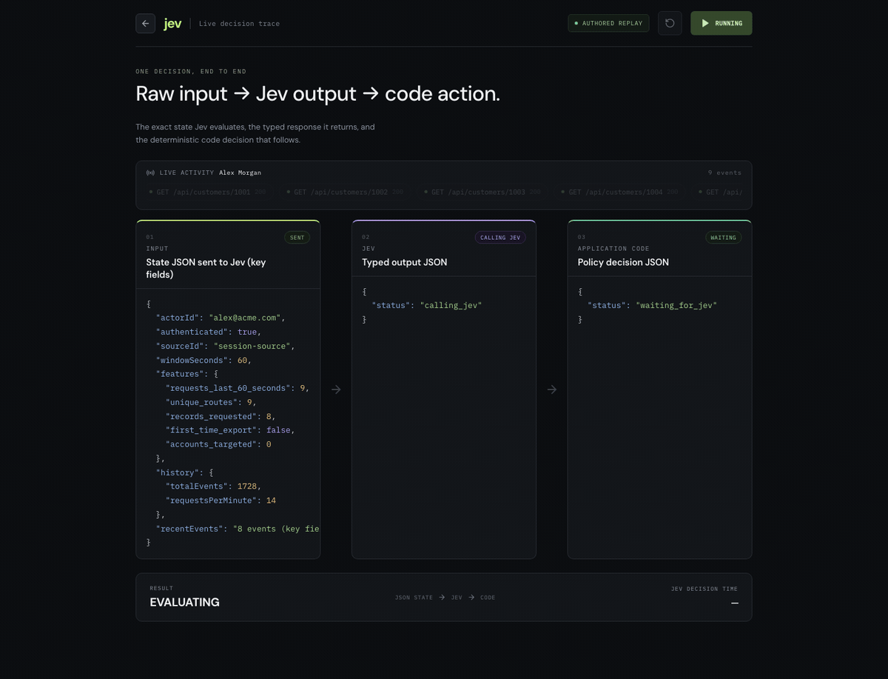

# Jev Runtime Shield

An open-source reference application showing how to use Jev inside a software control loop.

The application evaluates synthetic product activity, compares it with historical behavior, asks Jev for typed decisions, and applies deterministic policy before a sensitive action is allowed.

```text
Human → Benign → Allow
Bot   → Benign → Allow
Bot   → Malicious → Contain
```



Full-quality video with playback controls: [`media/jev-decision-trace.mp4`](media/jev-decision-trace.mp4).

## Run locally

Requirements:

- Git
- Node.js 22.13 or newer; Node.js 24 is recommended
- npm

Clone and install:

```bash
git clone https://github.com/am-kul/jev-realtime-behavioral-detection.git
cd jev-realtime-behavioral-detection
npm install
```

Start in replay mode:

```bash
npm run dev
```

Open [http://127.0.0.1:3000](http://127.0.0.1:3000).

Replay mode uses included fixtures. It does not require an API key, Docker, or an external database. The application creates and seeds a local SQLite database automatically.

## Use live Jev decisions

Generate an API key:

1. Open the [TypeSafe console](https://console.typesafe.ai/).
2. Sign in with Google or request a sign-in code by email.
3. Open the API keys area in the dashboard and create a key.
4. Copy the key and keep it private. Do not commit it to Git or expose it in browser code.

TypeSafe's [quick start](https://docs.typesafe.ai/introduction/quickstart) has the current API instructions.

Copy the example environment file:

```bash
cp .env.example .env
```

Add your TypeSafe API key to `.env`:

```dotenv
DECISION_MODE=jev
TYPESAFE_API_KEY=<YOUR_TYPESAFE_API_KEY>
JEV_MODEL=jev-latest
JEV_TIMEOUT_MS=5000
```

Start the application:

```bash
npm run dev
```

The API key remains on the server. Live mode sends synthetic decision context to the official TypeSafe API. Provider errors remain visible and sensitive actions stay held.

## See it

- **http://127.0.0.1:3000/showcase** — the Jev-focused view. Recent activity feeding the request, the exact state JSON sent to Jev, Jev's typed output JSON (with its measured decision time), and the policy JSON the application derives from it, ending in a plain `REQUEST BLOCKED` / `ALLOW` / `CHALLENGE` result.
- **http://127.0.0.1:3000/** — the application enforcing that decision: session revoked, credentials invalidated, account deactivated, export held at 0 of 48,219 records released.

Both run the same default scenario (`data-exfiltration`, ~8 seconds) so the two views tell one story.

## How it works

1. Synthetic activity is stored in SQLite.
2. The application calculates recent behavior and historical baselines.
3. Jev classifies the actor, intent, and applicable threat.
4. Deterministic policy allows, challenges, or contains the action.

Bot classification alone does not trigger containment. Benign automation is allowed. Sensitive exports remain pending until policy permits them.

## Verify changes

```bash
npm test
npm run build
```

## Scope

All activity and records are synthetic. Replay fixtures demonstrate application behavior; they do not measure Jev accuracy. This project is intended for local evaluation and extension. It is not a production security service and should not be exposed directly to the public internet.

MIT licensed. See [CONTRIBUTING.md](CONTRIBUTING.md) and [SECURITY.md](SECURITY.md).
